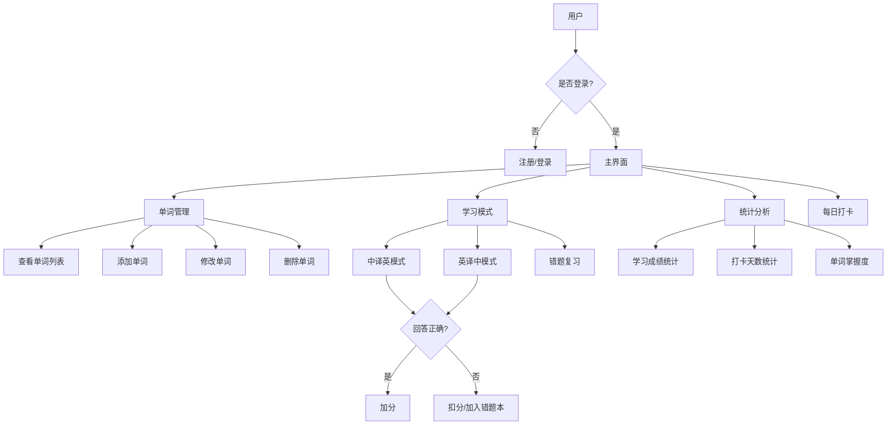

# 个性化背词系统

这是一个前后端分离的个性化背词系统，使用Vue.js + Element Plus开发前端界面，Flask提供后端API服务，支持用户注册、登录、单词管理、背诵学习和成绩统计等功能。

## 功能特点

1. 用户管理
   - 新用户注册
   - 用户登录
   - 打卡功能

2. 单词管理
   - 查看单词列表
   - 添加、修改、删除单词
   - 支持单词的词性和释义管理

3. 学习模式
   - 中译英模式
   - 英译中模式
   - 答对加分，答错扣分

4. 错题管理
   - 自动记录错题
   - 错题复习功能

5. 统计功能
   - 学习成绩统计
   - 连续打卡天数统计
   - 单词掌握程度统计

## 工作流程



## 技术栈

### 后端
- Python 3.x
- Flask (RESTful API)
- SQLite (数据存储)
- JWT (用户认证)

### 前端
- Vue.js 3
- Element Plus (UI框架)
- Vue Router
- Axios (HTTP客户端)

## 安装说明

1. 安装后端依赖：
   ```bash
   pip install -r requirements.txt
   ```

2. 安装前端依赖：
   ```bash
   cd frontend
   npm install
   ```

3. 初始化数据库：
   ```bash
   cd backend
   python3 init_db.py
   ```

## 启动服务

1. 启动后端服务器：
   ```bash
   cd backend
   python3 app.py
   ```

2. 启动前端开发服务器：
   ```bash
   cd frontend
   npm run dev
   ```

3. 访问应用：
   打开浏览器访问 http://localhost:3000

## 使用说明

1. 首次使用：
   - 访问首页，点击"去注册"按钮
   - 输入用户名和密码注册新账号
   - 注册成功后使用新账号登录

2. 日常使用：
   - 登录系统
   - 在主界面选择功能（预览单词、背诵单词、错题复习等）
   - 完成学习后可以查看成绩
   - 记得每天打卡，保持学习记录

## 项目结构

```
py_vocabulary/
├── backend/
│   ├── app.py          # 后端API服务器
│   ├── database.py     # 数据库操作类
│   ├── init_db.py      # 数据库初始化脚本
│   ├── models.py       # 数据模型
│   ├── routes.py       # API路由
│   └── vocabulary.db   # SQLite数据库文件
├── frontend/
│   ├── public/
│   │   └── index.html  # HTML模板
│   ├── src/
│   │   ├── assets/     # 静态资源
│   │   ├── components/ # Vue组件
│   │   ├── router/     # 路由配置
│   │   ├── store/      # Vuex状态管理
│   │   ├── views/      # 视图组件
│   │   ├── App.vue     # 根组件
│   │   └── main.js     # 入口文件
│   ├── package.json    # 前端依赖配置
│   ├── vite.config.js  # Vite配置
│   └── .env            # 环境配置
└── requirements.txt    # 后端依赖列表
```
DATA STRUCTURE
Users Table
id: INTEGER, Primary Key, Auto-increment
username: TEXT, Unique, Not Null
password: TEXT, Not Null
total_score: INTEGER, Default 0
Words Table
id: INTEGER, Primary Key, Auto-increment
word: TEXT, Not Null
part_of_speech: TEXT
meaning: TEXT, Not Null
frequency: INTEGER, Default 0
correct_times: INTEGER, Default 0
wrong_times: INTEGER, Default 0

## 注意事项

1. 确保后端服务器（端口5000）和前端开发服务器（端口3000）同时运行
2. 请妥善保管用户名和密码
3. 建议每天坚持打卡，保持学习记录
4. 如遇到问题，可以检查浏览器控制台和后端服务器日志
